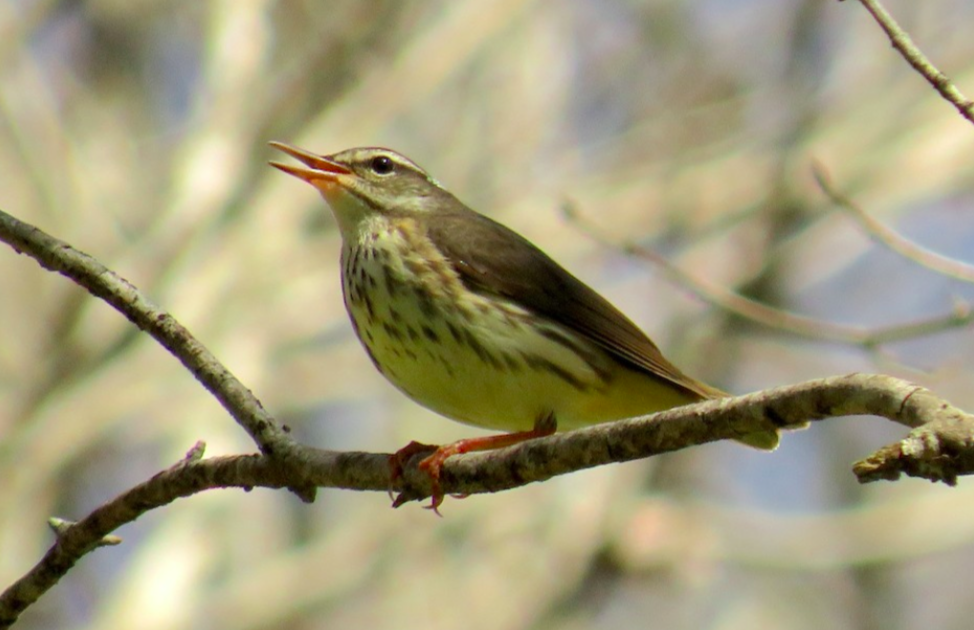

<body style="background-color:#2f633f">
```{=html}
<style type="text/css">

h1.title {
  font-size: 40px;
  font-family: "Times New Roman", Times, serif;
  color: Black;
  text-align: center;
}

h4.author { /* Header 4 - and the author and data headers use this too  */
  font-size: 25px;
  font-family: "Times New Roman", Times, serif;
  font-weight: bold;
  color: #D02349;
  text-align: center;
}

body {
  font-family: Helvetica;
  font-size: 12pt;
}

.zoom {
  transform-origin: 40% 50% 0;
  transition: transform .2s;
  margin: 0 auto;
}
.zoom img{
	width:auto;
	height:auto;	
}
.zoom:hover {
  transform: scale(2);
}

th, td {padding: 5px;}

</style>
```

<center>{width=80%}</center>
  

# <span style="color:white">Introduction
  
<span style="color:white">A typical songbird family is often depicted as a dedicated pair of two birds who raise their own clutch of offspring together. However, this concept of an exclusive commitment between two parent birds is not as common as often believed. While most songbirds form these seemingly committed breeding pairs, the practice of extra-pair fertilizations, or copulation with birds other than a pair-bonded or social mate, occur more often than previously understood. This breeding practice, called “social monogamy”, occurs in up to 90% of passerine birds (Van Noordwijk, 2002). One reason why birds may seek out extra-pair fertilizations is because true monogamy, known as “sexual monogamy”, often restricts the breeding pair by having fewer opportunities to spread their genes, and requiring more time spent rearing a limited number of young (Mays, 2001). Social monogamy could act as a method in which birds rely on a mate for territory and nest protection, while the genetic polygamy can also increase the likelihood of successful fertilizations and increase the chances of producing offspring that are able to survive. 
  
  
<span style="color:white">Extrapair copulations often occur when males seek mating opportunities with a female other than (or instead of) a paired mate to increase the number of offspring he is able to sire (Berzins and Dawson, 2019). Opportunistic mating by less-dominant “floater” males can also result in extra-pair fertilizations, as these non-territorial males will be seeking out any opportunities to mate (Moreno, 2016, Rivers et al., 2020). On the other hand, females may seek out extrapair mates to increase the chances of a successful fertilization, or to increase the chances of mating with a male who will pass on the highest quality genes to her offspring (Kleven et al., 2009). Extrapair fertilizations are often particularly important in populations where other potential partners of the same species are less accessible (Mattsson et al., 2011). While we do not have a complete understanding of the benefits of this reproductive strategy, a possible explanation is that extrapair copulations can help preserve genetic diversity and avoid deleterious recessive alleles from becoming more common in the population as a result of inbreeding (Hajdasz et al., 2019). 
  
  
<span style="color:white">Several factors have been researched that influence the prevalence of extrapair mating behaviors in various songbird species. One such factor is population density: more neighboring breeding birds will provide more opportunities for extra-pair fertilizations to occur (Berzins and Dawson, 2019). Densely-packed or colonial bird territories tend to show a high prevalence of extrapair offspring: In a study looking at Indigo Buntings, it was found that on average, 35% of the nestlings they collected blood samples from had more genetic similarities with the female parent than the male parent, indicating that extra-pair fertilizations from males other than the resident male were occurring (Westneat et al., 1990). 
  
  
<span style="color:white">While the frequency of extrapair matings have been more extensively studied in species with dense populations, their prevalence in species that have lower population densities are not as well understood. The Louisiana Waterthrush (Parkesia motacilla), hereafter LOWA, is a warbler (Parulidae) species that breeds in the eastern United States, and has a uniquely restrictive breeding territory (Mulvihill, 2002). Breeding territories for LOWA are established primarily along perennial streams in mature deciduous forests, creating linear territories up to 1.5 km long (Mattson and Cooper, 2009). Due to this unique territory structure, the LOWA is a prime species to study the frequency of extra-pair fertilizations. The linear nature of their territory typically allows for at most two immediate neighbors, which greatly reduces the accessibility of extra-pair fertilization opportunities compared to other species with a more dense population structure, as would be the case in species with non-linear territories (Craig, 1985, Mulvihill, 2002). The prevalence of extrapair breeding behavior in LOWA has not been studied, and this research could add important information to understanding the genetic structure within its breeding system.
  
<center>{width=60%}</center>
  
<span style="color:white">Louisiana Waterthrush often return to the same breeding grounds every year, which in turn often means that they breed near the same limited number of neighbors, reducing the genetic variation between available mating partners (Mays, 2001, Mattsson et al., 2011). Having a limited number of neighbors could be a concern in species like LOWA that require large territory ranges or have highly-specific habitat types, essentially causing a geographic barrier to extra-pair mating opportunities (Mordecai et al., 2011). Low population numbers and habitat fragmentation caused by human activity can similarly reduce the number of available mates (Mattsson et al., 2011). Habitat fragmentation is a major contributor to population decline for almost every species; in addition to breaking up larger tracts of land and thus reducing the number of neighbors within a population, the environmental barriers from fragmented habitats could also decrease the likelihood of LOWA successfully being able to seek out extra-pair mating opportunities (Mattsson et al., 2011). 
  
  
<span style="color:white">Understanding how often extra-pair fertilizations occur in LOWA is impossible to do from a purely observational standpoint (Neudorf, 1996). However, genetic technology is a valuable tool to characterize these extra-pair fertilization behaviors (Wink, 2006). Genetic parentage analyses often use microsatellites to assess parentage between offspring and known adults from a population, providing insight into the prevalence of extra-pair fertilizations and identity of extrapair mates. Microsatellites are tandem repeats of non-coding DNA (e.g., GATAGATA; AGTAGTAGT) found throughout most vertebrate genomes. Interindividual variation in the number of repeats within each locus (i.e., alleles) is heritable, and can thus be used to determine parentage of sampled putative offspring or nestlings. (Queller et al., 1993). Microsatellite analysis offers a unique insight into songbird population studies, which will allow me to better understand the dynamics of the LOWA’s breeding behavior and the potential impacts of environmental factors on their reproductive success. Because LOWA have a territory structure that is unique among eastern North American birds, they provide an opportune chance to examine how extrapair mating operates within a linear territory, and therefore low-density territorial system.
  
  
<span style="color:white">Understanding the genetic diversity of songbird populations, such as the Louisiana Waterthrush, is essential information that allows us to better comprehend how both humans and natural events may impact those species. This information can additionally provide insight into the importance of protecting these habitats and corridors necessary for their survival and ability to flourish. Here I will investigate the frequency of extra-pair fertilization in LOWA and ask if the number of extrapair young in nests is related to population density. Specifically, I hypothesize that LOWA population density is positively correlated with the number of nestlings that are the result of extra-pair fertilization. 
  
  
# <span style="color:white">Methods
  
## <span style="color:white">Locating territories
  
```{r setup, include=FALSE}
# install.packages('pacman')
# pacman::p_load("ggsn","leaflet","mapdata","maptools","OpenStreetMap","rgdal","tidyverse")

library(leaflet)
library(mapdata)
library(maptools)
library(tidyverse)
library(rgdal)
library(ggspatial)
library(ggsn)
```
  
  
```{r, include=FALSE}
state <- map_data("state")
county <- map_data("county")
beaman_point <- data.frame("x" = -86.905274, "y" = 36.269134)
rotary_point <- data.frame("x" = -87.271600, "y" = 36.501317)
cheatham_point <- data.frame("x" = -87.063088, "y" = 36.188858)
schiller_point <- data.frame("x" = -87.314360, "y" = 36.437066)

tn <- county %>% 
  filter(region=="tennessee")

davco <- county %>% 
  filter(region=="tennessee") %>% 
  filter(subregion=="davidson")

monco <- county %>% 
  filter(region=="tennessee") %>% 
  filter(subregion=="montgomery")

checo <- county %>% 
  filter(region=="tennessee") %>% 
  filter(subregion=="cheatham")
```
```{r, echo=FALSE, fig.align="center"}
ggplot() + geom_polygon(data = state, aes(x=long, y = lat, group = group),
                        fill = "white", color="#37697c") + 
           geom_polygon(data = tn, aes(x=long, y = lat, group = group),
                        fill = "#aee5dd", color="#37697c") + 
           geom_polygon(data = davco, aes(x=long, y = lat, group = group),
                        fill = "#4d9389", color="black") + 
           geom_point(data = beaman_point, aes(x=x,y=y), color="#fbeb66") +
           geom_polygon(data = monco, aes(x=long, y = lat, group = group),
                        fill = "#4d9389", color="black") + 
           geom_point(data = schiller_point, aes(x=x,y=y), color="#fbeb66") + 
           geom_point(data = rotary_point, aes(x=x,y=y), color="#fbeb66") +
           geom_polygon(data = checo, aes(x=long, y = lat, group = group),
                        fill = "#4d9389", color="black") + 
           geom_point(data = cheatham_point, aes(x=x,y=y), color="#fbeb66") +
  coord_fixed(xlim = c(-90, -82.5),  ylim = c(34.8, 37), ratio = 1.2) + 
  xlab("Longitude") + ylab("Latitude") + ggtitle("Louisiana Waterthrush Research Locations")+
  labs(caption="Figure 1. Map of Tennessee showing the four locations of my research's study sites. Two sites are located in Montgomery 
       County, one site is located in Cheatham County, and one site is located in Davidson County.                      ")
```
  
  
<span style="color:white">The first step to my research is to locate Louisiana Waterthrush territories in the greater Clarksville area. Many LOWA breeding territories are already known from previous students’ research in the Woltmann lab. Finding the locations will primarily include re-locating these known territories and verifying which birds are occupying the territories. Furthermore, I would like to search for additional isolated-pair territory sites to have a stronger genetic comparison between the low-density and higher-density populations with multiple LOWA pairs. 
  
  
<span style="color:white">LOWA occupy territories in riparian forested habitats with fast-moving streams. These streams also require some amount of sloped or cut banks for LOWA nesting, and are often found to prefer a dense, oak-forest canopy cover (Eaton, 1958). The territory of a LOWA extends anywhere between 200m – 1.5km in length along the stream, with an average length of 400m, and only extends approximately 10m onto either side of the stream bank (Eaton, 1958). Males arrive in Tennessee for the breeding season as early as late March, but the average arrival time of males in often closer to mid-April, where they will immediately establish a breeding territory. Female LOWA usually arrive in mid-late April (Eaton, 1958). 
  
  
<span style="color:white">**You can explore each of these sites in more detail with these interactive maps:**
  
  
```{r, include=FALSE}
lowaOGR <- readOGR("./data/Beaman2021.kml")
lowa2OGR <- readOGR("./data/Rotary2021.kml")
lowa3OGR <- readOGR("./data/Schiller2021.kml")
lowa4OGR <- readOGR("./data/Cheatham2021.kml")
```
```{r Map, fig.align="center", echo=FALSE}
leaflet(lowaOGR) %>% 
  addTiles() %>%
  addProviderTiles(providers$CartoDB.Positron, group = "CartoDB") %>%
  addProviderTiles(providers$Esri.NatGeoWorldMap, group = "NatGeo") %>%
  addProviderTiles(providers$Esri.WorldImagery, group = "ESRI") %>%
    setView(lng = -86.917820, lat = 36.259360, zoom = 16) %>%
  addCircleMarkers(popup = lowaOGR@data$Description,
                   label = lowaOGR@data$Name,
                   weight = 2,
                   color = "white",
                   fillColor = "green",
                   fillOpacity = 0.9) %>%
  addMiniMap(zoomLevelOffset = -4, width = 100, height = 120)  %>%
  addLayersControl(
    baseGroups = c("ESRI", "NatGeo", "OSM", "CartoDB"),
    options = layersControlOptions(collapsed = FALSE),
    overlayGroups = "Beaman Park")
```

```{r Map2, fig.align="center", echo=FALSE}
leaflet(lowa2OGR) %>% 
  addTiles() %>%
  addProviderTiles(providers$CartoDB.Positron, group = "CartoDB") %>%
  addProviderTiles(providers$Esri.NatGeoWorldMap, group = "NatGeo") %>%
  addProviderTiles(providers$Esri.WorldImagery, group = "ESRI") %>%
    setView(lng = -87.265213, lat = 36.498094, zoom = 16) %>%
  addCircleMarkers(popup = lowa2OGR@data$Description,
                   label = lowa2OGR@data$Name,
                   weight = 2,
                   color = "black",
                   fillColor = "lightblue",
                   fillOpacity = 0.9) %>%  
  addMiniMap(zoomLevelOffset = -4, width = 100, height = 120)  %>%
  addLayersControl(
    baseGroups = c("ESRI", "NatGeo", "OSM", "CartoDB"),
    options = layersControlOptions(collapsed = FALSE),
    overlayGroups = "Rotary Park")
```

```{r Map3, fig.align="center", echo=FALSE}
leaflet(lowa3OGR) %>% 
  addTiles() %>%
  addProviderTiles(providers$CartoDB.Positron, group = "CartoDB") %>%
  addProviderTiles(providers$Esri.NatGeoWorldMap, group = "NatGeo") %>%
  addProviderTiles(providers$Esri.WorldImagery, group = "ESRI") %>%
    setView(lng = -87.316060, lat = 36.437329, zoom = 16) %>%
  addCircleMarkers(popup = lowa3OGR@data$Description,
                   label = lowa3OGR@data$Name,
                   weight = 2,
                   color = "black",
                   fillColor = "orange",
                   fillOpacity = 0.9) %>%
    addMiniMap(zoomLevelOffset = -4, width = 100, height = 120)  %>%
  addLayersControl(
    baseGroups = c("ESRI", "NatGeo", "OSM", "CartoDB"),
    options = layersControlOptions(collapsed = FALSE),
    overlayGroups = "Dr. Schiller's Property")
```

```{r Map4, fig.align="center", echo=FALSE}
leaflet(lowa4OGR) %>% 
  addTiles() %>%
  addProviderTiles(providers$CartoDB.Positron, group = "CartoDB") %>%
  addProviderTiles(providers$Esri.NatGeoWorldMap, group = "NatGeo") %>%
  addProviderTiles(providers$Esri.WorldImagery, group = "ESRI") %>%
    setView(lng = -87.063506, lat = 36.188282, zoom = 16) %>%
  addCircleMarkers(popup = lowa4OGR@data$Description,
                   label = lowa4OGR@data$Name,
                   weight = 2,
                   color = "white",
                   fillColor = "red",
                   fillOpacity = 0.9) %>%  addMiniMap(zoomLevelOffset = -4, width = 100, height = 120)  %>%
  addLayersControl(
    baseGroups = c("ESRI", "NatGeo", "OSM", "CartoDB"),
    options = layersControlOptions(collapsed = FALSE),
    overlayGroups = "Cheatham WMA")
```

<center>{width=80%}</center>
  
  
</body>